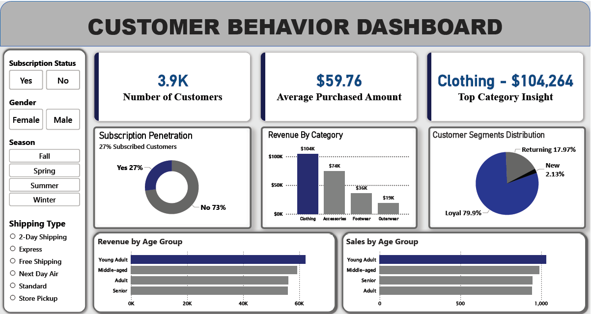

# 🛍 Customer Behavior Analysis

An end-to-end **data analytics project** that analyzes retail customer behavior and converts raw transactional data into actionable business insights using **Python, SQL, and Power BI**.

This project demonstrates the **complete analytics workflow used by data analysts in real business environments**.

---

## 📊 Dashboard Preview



---
## 🎯 Business Problem

Retail companies collect large volumes of customer transaction data, but without proper analysis it is difficult to understand:

* Which customers generate the most revenue
* Which product categories drive sales
* How customer demographics affect purchasing behavior

This project analyzes customer data to uncover **key revenue drivers and customer segments**.

---
## 📊 Data Source

The dataset used in this project contains retail customer transaction data including demographic attributes and purchase behavior.

**Source:** Kaggle
**Dataset:** Customer Shopping Behavior Dataset

The dataset includes the following key attributes:

* Customer demographics (age, gender)
* Product category and purchase details
* Purchase amount and transaction behavior
* Subscription status and shipping type
* Seasonal purchasing trends

This dataset was used to analyze **customer purchasing patterns, revenue distribution, and behavioral segmentation**. 

---
## 🛠 Tech Stack

### Data Processing

* Python
* Pandas
* NumPy

### Data Analysis

* SQL

### Data Visualization

* Power BI

---

## 📂 Project Workflow

### 1️⃣ Data Cleaning (Python)

The raw dataset was cleaned and prepared using Python.

**Tasks performed**

* Removed duplicate records
* Handled missing values
* Standardized categorical data
* Prepared dataset for SQL analysis

**Libraries Used**

* Pandas
* NumPy

---

### 2️⃣ Business Analysis (SQL)

SQL queries were used to generate key business insights:

* Revenue by product category
* Customer segmentation
* Sales by age group
* Average purchase value

**Example Query**

```sql
SELECT category, SUM(purchase_amount) AS revenue
FROM sales
GROUP BY category
ORDER BY revenue DESC;
```

---

### 3️⃣ Data Visualization (Power BI)

An interactive **Power BI dashboard** was built to help stakeholders quickly understand customer behavior.

**Key Dashboard Features**

* Customer KPI metrics
* Revenue by category
* Customer segmentation
* Age group purchasing trends

**Interactive Filters**

* Gender
* Season
* Subscription Status
* Shipping Type

---

## 📊 Key Metrics

| Metric                 | Value  |
| ---------------------- | ------ |
| Customers Analyzed     | 3,900+ |
| Average Purchase Value | $59.76 |
| Top Category Revenue   | $104K  |
| Subscription Rate      | 27%    |

---

## 📈 Key Insights

### Customer Segmentation

* Loyal customers → **79.9%**
* Returning customers → **17.97%**
* New customers → **2.13%**

### Revenue Insights

Top performing categories:

1. Clothing — **$104K**
2. Accessories — **$74K**
3. Footwear — **$36K**
4. Outerwear — **$19K**

### Customer Trends

* Young adults generate the **highest revenue**
* Middle-aged customers show **strong purchase frequency**

---

## 💡 Business Recommendations

Based on the analysis:

* Increase marketing focus on **young adult customers**
* Promote **clothing category bundles**
* Improve **subscription adoption (currently 27%)**

---

## 📁 Repository Structure

```
customer-behavior-analysis
│
├── data
├── notebooks
├── sql
├── dashboard
├── images
└── README.md
```

---

## 🚀 Future Improvements

* Customer lifetime value analysis
* RFM customer segmentation
* Predictive sales forecasting
* Advanced Power BI DAX metrics

---

## 👤 Author

**Aniket Jaiswal**

Data Analyst Portfolio Project

Python | SQL | Power BI | Data Visualization
